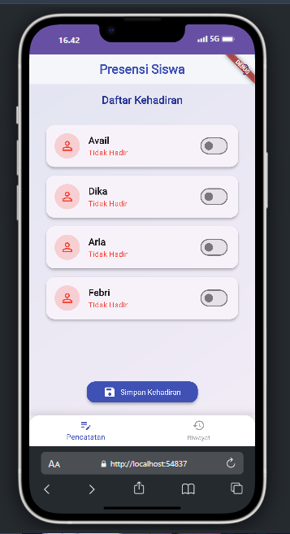
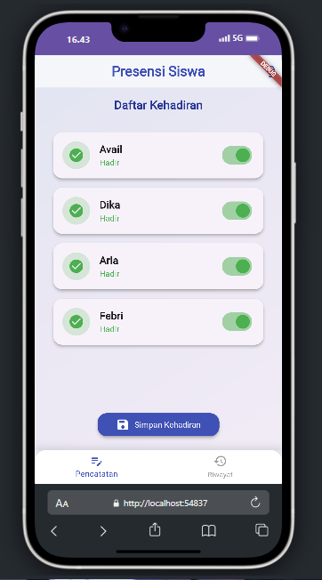
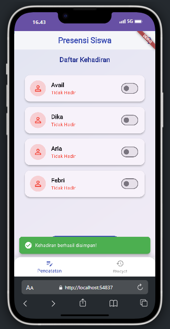
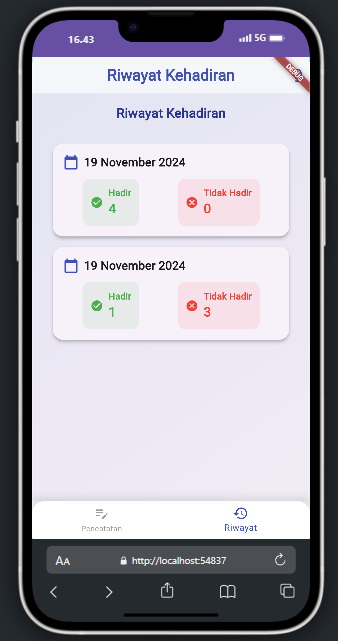

# 📚 Aplikasi Monitoring Kehadiran Siswa
# Avail Dwi Febrianto
# 2D TRPL (2170)

<div align="center">
  
  
  
  
  
  [](https://opensource.org/licenses/MIT)
</div>

## 📱 Tentang Aplikasi

Aplikasi Monitoring Kehadiran Siswa adalah sebuah aplikasi mobile yang dikembangkan menggunakan Flutter untuk memudahkan pencatatan dan pemantauan kehadiran siswa di kelas. Aplikasi ini menyediakan antarmuka yang intuitif dan menarik untuk mengelola data kehadiran siswa secara efisien.

## ✨ Fitur Utama

<div align="center">
  
  
  
  
</div>

- 📝 **Pencatatan Kehadiran**
  - Daftar siswa dengan tampilan yang menarik
  - Toggle kehadiran dengan animasi yang smooth
  - Penyimpanan status kehadiran secara real-time

- 📊 **Riwayat Kehadiran**
  - Tampilan riwayat yang informatif
  - Statistik kehadiran per periode
  - Visualisasi data yang mudah dipahami

- 🎨 **UI/UX Modern**
  - Desain material yang elegan
  - Animasi yang responsif
  - Tema warna yang menarik
  - Mode gelap & terang (lupa jirr)

## 🔍 Preview Aplikasi

<div align="center">
  
</div>

## 🚀 Teknologi yang Digunakan

- **Flutter**: Framework UI untuk pengembangan aplikasi
- **Dart**: Bahasa pemrograman utama
- **Provider**: State management
- **Material Design**: Panduan desain UI/UX

## 📥 Cara Instalasi

1. **Prasyarat**
   ```bash
   # Pastikan Flutter sudah terinstall
   flutter doctor
   ```

2. **Clone Repository**
   ```bash
   git clone https://github.com/username/absensi-siswa.git
   cd absensi-siswa
   ```

3. **Install Dependencies**
   ```bash
   flutter pub get
   ```

4. **Jalankan Aplikasi**
   ```bash
   flutter run
   ```


```

```

## 🔧 Konfigurasi Assets

1. **Tambahkan Assets di pubspec.yaml**
   ```yaml
   flutter:
     assets:
       - assets/images/
   ```

2. **Setup Provider**
   ```dart
   void main() {
     runApp(
       ChangeNotifierProvider(
         create: (_) => AttendanceProvider(),
         child: MyApp(),
       ),
     );
   }
   ```

## 📚 Panduan Penggunaan

1. **Pencatatan Kehadiran**
   <div align="center">
     
   </div>
   - Buka aplikasi dan pilih tab "Pencatatan"
   - Tap switch pada nama siswa untuk menandai kehadiran
   - Tekan tombol "Simpan" untuk menyimpan data

2. **Melihat Riwayat**
   <div align="center">
     
   </div>
   - Pilih tab "Riwayat"
   - Scroll untuk melihat riwayat kehadiran
   - Tap pada item untuk detail lengkap

## 👥 Kontribusi

Kontribusi selalu diterima! Berikut langkah-langkah untuk berkontribusi:

1. Fork repository ini
2. Buat branch baru (`git checkout -b fitur-baru`)
3. Commit perubahan (`git commit -m 'Menambah fitur baru'`)
4. Push ke branch (`git push origin fitur-baru`)
5. Buat Pull Request

## 📝 tugas Praktikum

## Link

Link Proyek: [https://github.com/xfbriianto/absensi-siswa-flutter](https://github.com/xfbriianto/absensi-siswa-flutter)

---
<div align="center">
  <p>Dibuat dengan ❤️ menggunakan Flutter</p>
  
  
</div>
